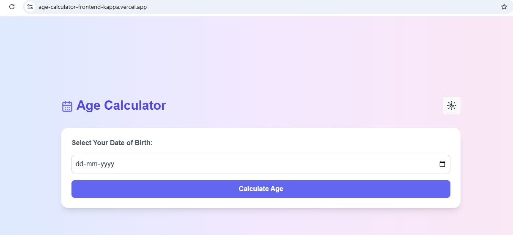
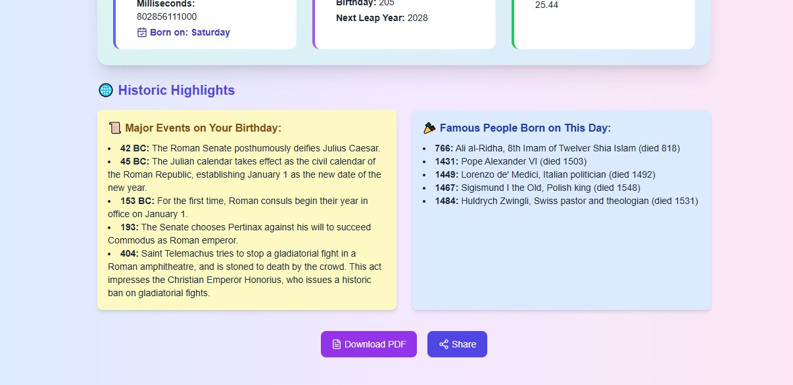
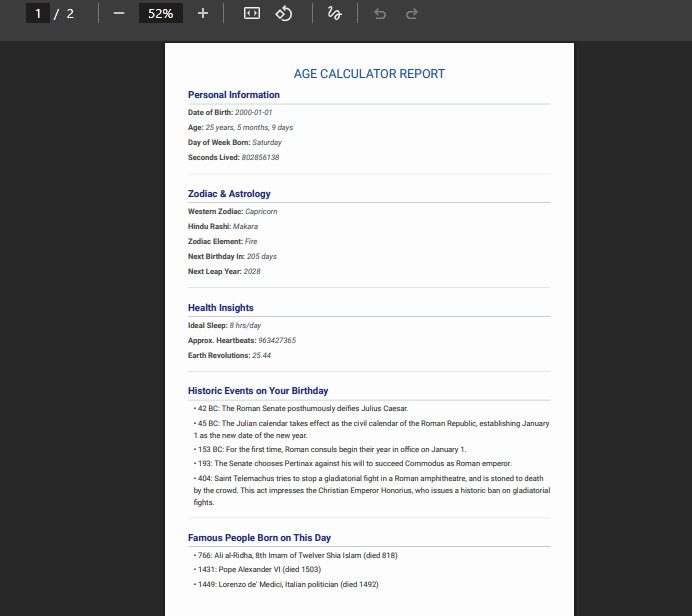

### Welcome to ***[Age Calculator Web Application](https://age-calculator-frontend-kappa.vercel.app/)***

## 📚 Table of Contents

- [Project Description](#project-description)
- [Features](#features)
- [Technologies Used](#technologies-used)
- [Screenshots](#screenshots)
- [Link](#link)
- [Installation](#installation)
- [Usage](#usage)
- [Deployment](#deployment)
- [Future Enhancements](#future-enhancements)
- [Author](#author)
- [Contributing](#contributing)
- [Acknowledgments](#acknowledgments)
- [License](#license)

---

##  Project Description

The **Age Calculator Web App** is an interactive tool that lets users calculate their exact age in **years, months, and days**, along with other fascinating insights such as zodiac signs, Hindu Rashi, leap year info, next birthday countdown, and health-related metrics.

It consists of a modern frontend (React + Tailwind CSS) and a robust backend (Node.js + Express + Supabase) to process and optionally store age-related data.

---

##  Features

- ✅ Calculate accurate age (years, months, days)
- 🪐 Show **Zodiac Sign** and **Hindu Rashi**
- 📆 Countdown to next birthday
- 🔁 Leap year detection
- 📅 Display day of birth
- 💓 Calculate approximate heartbeats, sleep hours, breaths taken, etc.
- 📤 Social sharing (Twitter, WhatsApp, Email, LinkedIn)
- 📄 Generate & download PDF reports
- 🎊 Confetti celebration animation on birthdays
- 🧠 Memory-efficient design and smooth animations

---

 ## Technologies Used

### 🔹 Frontend
- React (Vite)
- Tailwind CSS
- Lucide React Icons
- React Confetti
- React PDF Renderer

###  Backend
- Node.js
- Express.js
- Supabase (PostgreSQL DB)
- dotenv, cors

---

##  Screenshots

| Age Calculator | Sharing Options | PDF Report |
|----------------|-----------------|------------|
|  |  |  |

---

## Link

Live site Url: [Age Calculator](https://age-calculator-frontend-kappa.vercel.app/)

---
##  Installation

### 1. Clone the Repositories

```bash
git clone https://github.com/Saras171/Age_Calculator.git
```
### 2. Setup Backend:

- Navigate to the project directory:
```bash
cd backend
```
- Install Dependencies:
 ```bash
npm install
```
- Create a .env file in the root directory:
```bash
PORT=5001
SUPABASE_URL=your_supabase_url
SUPABASE_KEY=your_supabase_key
```
- Then start the server:
```bash
node server.js
```
or
```bash
nodemon server.js
```
It should run at: [http://localhost:5001]

### 3. Setup Frontend:
```bash
cd frontend
npm install
npm run dev
```
- Create a .env file in the root directory:
```bash
VITE_API_URL= your-backend-url 
VITE_BASE_URL= your-frontend-url 
```
It should run at: [http://localhost:5173] (default Vite port).

*note: you should update or change your backend and frontend urls in environment variable after their successful deployment.

---
##  Usage

1. Visit the app

2. Enter your date of birth

3. Click Calculate

4. View your age, Rashi, zodiac, birth weekday, and fun stats

5. Share the result or download PDF report.
 --- 
 ##  Future Enhancements

 - User login & profile

- Save & view past calculations (History)

- Multilingual support

- Birthday reminders and notifications

- Export result as image
 ---

 ##  Author
- ***Saraswati Rawat***

- LinkedIn: [@SaraswatiRawat](https://www.linkedin.com/in/saraswati-rawat-534a02184)

- GitHub Repository: [Age Calculator Git Repository](https://github.com/Saras171/Age_Calculator.git)
---
##  Contributing

Contributions are welcome! 🤝
Open an issue or submit a pull request.

---
##  License
This project is licensed under the 📄 [MIT License](/License).
